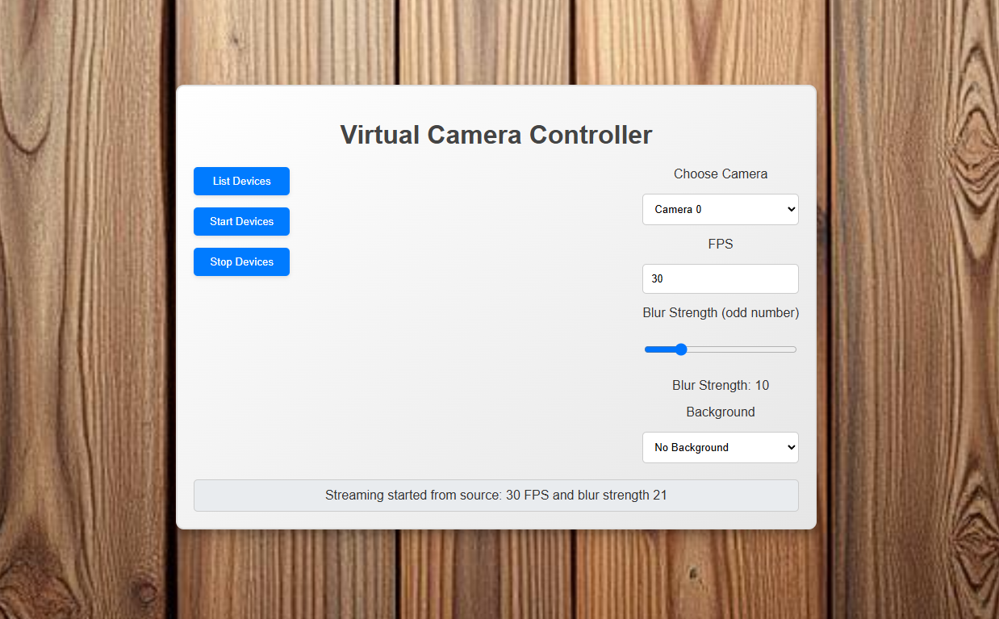

# Video Broadcaster

Real-time video effects for your webcam using YOLOv8 segmentation.

## 📖 Description

Video Broadcaster is a real-time video processing application that uses YOLOv8 object segmentation to apply various 
effects to your webcam feed. 

The application can remove backgrounds, add custom backgrounds, or apply blur effects.

The system works by:
1. Capturing frames from your webcam
2. Using YOLOv8 to generate segmentation masks
3. Applying effects based on these masks
4. Streaming the processed video to a virtual camera (OBS Virtual Camera)

## ✨ Features

- **Background Removal**: Remove your background in real-time
- **Background Replacement**: Add custom backgrounds to your video
- **Blur Effects**: Apply blur to backgrounds while keeping you in focus
- **Virtual Camera Output**: Stream to any application that accepts webcam input
- **GPU Acceleration**: Optimized for NVIDIA GPUs with CUDA support

## 🛠️ Installation

### Prerequisites

- NVIDIA GPU with CUDA support (optional but recommended)
- OBS (Virtual Camera enabled)

### Step-by-Step Setup

1. **Create and activate a conda environment:**
   ```bash
   conda create -n broadcaster python=3.11
   conda activate broadcaster
   ```

2. **Install PyTorch with CUDA support (GPU users only):**
   ```bash
   conda install pytorch==2.5.1 torchvision==0.20.1 torchaudio==2.5.1 pytorch-cuda=11.8 -c pytorch -c nvidia
   ```

3. **Install required packages:**
   ```bash
   pip install -r requirements.txt
   ```

4. **Verify GPU setup (GPU users only):**
   ```python
   import torch
   print(torch.cuda.is_available())
   ```
   This should return `True` if CUDA is properly configured.

## 📦 Dependencies

The project requires the following Python packages:

- `uvicorn` - ASGI server for running the application
- `fastapi` - Web framework for API endpoints
- `pyvirtualcam` - Virtual camera interface
- `opencv-python` - Computer vision and image processing
- `ultralytics` - YOLOv8 implementation

## 🚀 Frontend



## 🔧 Troubleshooting

### GPU Issues
- Ensure you have the correct NVIDIA drivers installed
- Verify CUDA compatibility with your GPU
- Check that PyTorch detects your GPU with `torch.cuda.is_available()`

### Virtual Camera Issues
- Make sure OBS Virtual Camera is installed and properly configured
- Restart your video conferencing application after starting the broadcaster
